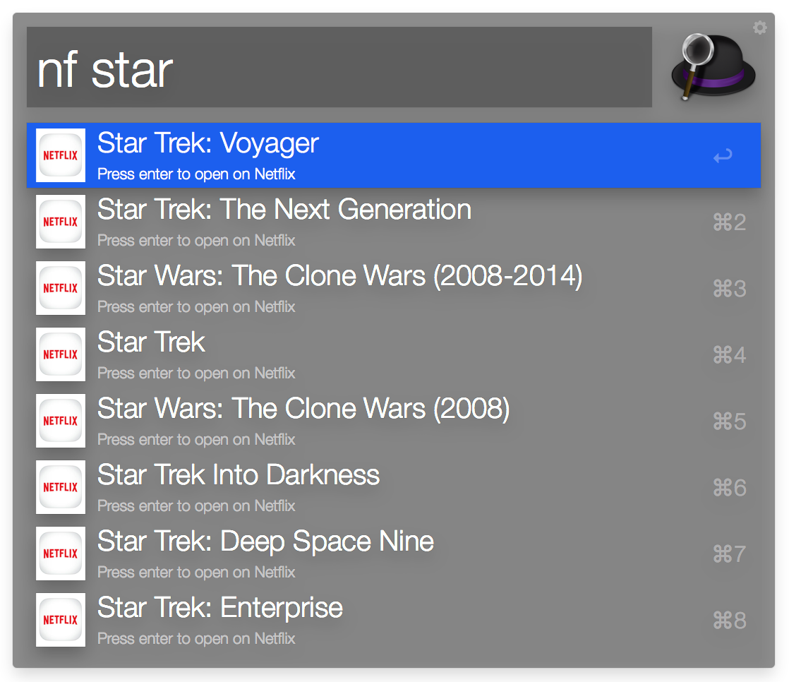
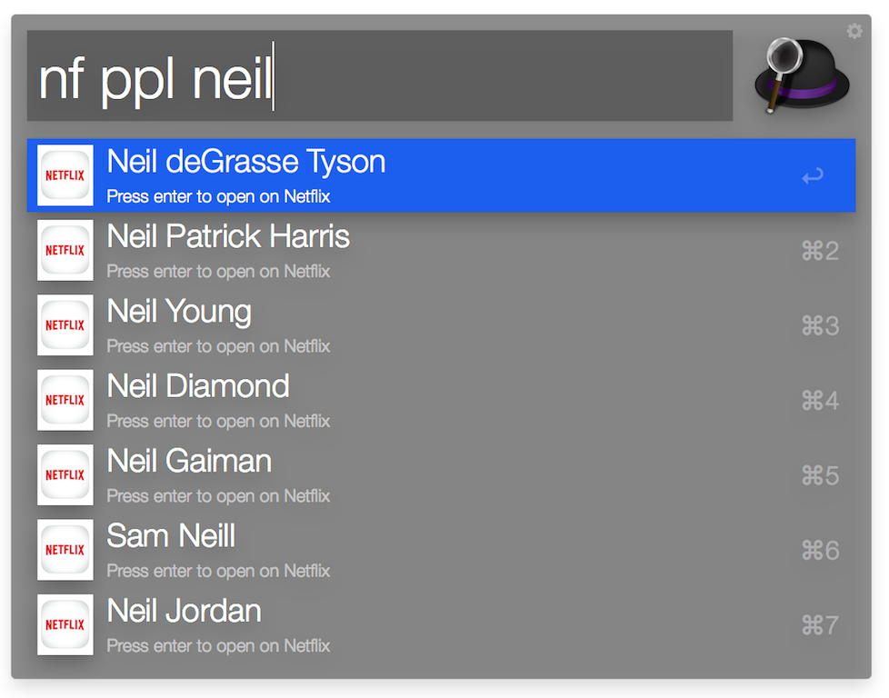

# Netflix Alfred Workflow
 

**Website:** https://github.com/dkarter/AlfredNetflixSearchWorkflow

**Netflix API (unofficial):** https://github.com/dkarter/NetflixScraperAPI

**License:** MIT

**Disclaimer:** I am not connected and or affiliated with Netflix, this code was written purely for educational purposes and with no other intent, warranty or purpose. Use at your own risk and responsibility.
 
 

## Installation

Please use Packal to download the workflow - it will provide AutoUpdate functionality.

http://www.packal.org/workflow/netflix-search

## Usage

### Searching for a movie/tv-show

nf [name of movie]

- Netflix Search Workflow will automatically suggest matching titles.
- Pressing enter (⏎) will open the Netflix player in your browser and start playing the movie
 - If you are opening a previously watched TV show/movie it will continue where you stopped last
- Pressing Command (⌘) and Enter (⏎) will open the movie page which includes synopsis, cover, reviews
  - if the title is a TV show it will allow you to select the episode you would like to watch on that page

### Searching for an actor/director etc

nf ppl [name of person]

- Netflix Search Workflow will automatically suggest matching names based on roles in movies in Netflix.
- Press enter (⏎) to open a page with a list of movies by/with that person
